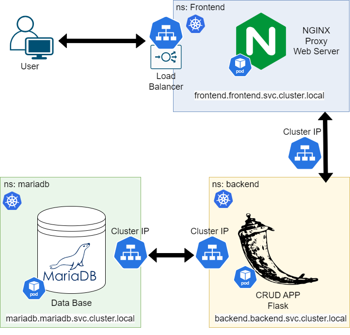

# CBD-3324 - Dockerizing and Orchestrating a Microservices Application

## Overview
This project demonstrates the containerization and orchestration of a microservices application using Docker, Kubernetes, Helm, and ArgoCD. In a nutshell, it consists of three major components that include:

1. **Backend**: A REST API service based on Flask.
2. **Frontend**: A web interface served through NGINX.
3. **Database**: A MariaDB database for persistent data storage.

## Project Diagram


## Project Structure

### Application Structure
```
├── backend/
│   ├── app.py                 # Main Flask application
│   ├── Dockerfile             # Dockerfile for backend
│   ├── init_db.sql            # SQL script to initialize database
│
├── frontend/
│   ├── index.html             # Frontend HTML
│   ├── script.js              # JavaScript for frontend
│   ├── styles.css             # Styling for frontend
│   ├── nginx.conf             # Custom NGINX configuration
│   ├── Dockerfile             # Dockerfile for frontend
│   ├── docker-compose.yml     # Compose file for local deployment
```

### Kubernetes (k8s) Directory Structure
```
. ├── k8s
│   ├── frontend-chart
│   │   ├── Chart.yaml         # Helm chart metadata for the frontend
│   │   ├── templates/         # Contains Kubernetes manifests for frontend
│   │   │   ├── configmap.yaml # Frontend ConfigMap
│   │   │   ├── deployment.yaml # Frontend Deployment
│   │   │   └── service.yaml   # Frontend Service
│   │   └── values.yaml        # Default values for the frontend chart
│   ├── backend-chart
│   │   ├── Chart.yaml         # Helm chart metadata for the backend
│   │   ├── templates/         # Contains Kubernetes manifests for backend
│   │   │   ├── configmap.yaml # Backend ConfigMap
│   │   │   ├── deployment.yaml # Backend Deployment
│   │   │   └── service.yaml   # Backend Service
│   │   └── values.yaml        # Default values for the backend chart
│   ├── mariadb-chart
│   │   ├── Chart.yaml         # Helm chart metadata for MariaDB
│   │   ├── templates/         # Contains Kubernetes manifests for MariaDB
│   │   │   ├── configmap.yaml # MariaDB ConfigMap
│   │   │   ├── deployment.yaml # MariaDB Deployment
│   │   │   ├── secret.yaml    # MariaDB Secret for credentials
│   │   │   └── service.yaml   # MariaDB Service
│   │   └── values.yaml        # Default values for the MariaDB chart
├── frontend-app.yaml           # ArgoCD Application for frontend
├── backend-app.yaml            # ArgoCD Application for backend
├── mariadb-app.yaml            # ArgoCD Application for MariaDB
```

## Prerequisites
- Docker
- Kubernetes Cluster (e.g., Minikube, kind, or managed Kubernetes)
- Helm
- ArgoCD
- GitHub CLI (for pushing images)

## Deployment Steps

### 1. Create Namespaces
```bash
kubectl create namespace mariadb
kubectl create namespace backend
kubectl create namespace frontend
```

### 2. Deploy MariaDB
```bash
kubectl apply -f k8s/mariadb/secret.yaml
kubectl apply -f k8s/mariadb/configmap.yaml
kubectl apply -f k8s/mariadb/deployment.yaml
kubectl apply -f k8s/mariadb/service.yaml
```

### 3. Deploy Backend
```bash
kubectl apply -f k8s/backend/deployment.yaml
kubectl apply -f k8s/backend/service.yaml
kubectl apply -f k8s/backend/secret.yaml
```

### 4. Deploy Frontend
```bash
kubectl apply -f k8s/frontend/deployment.yaml
kubectl apply -f k8s/frontend/service.yaml
```

### 5. Docker Build and Push
Build and push images to the GitHub Container Registry:
```bash
docker build -t ghcr.io/frankrodrigo/backend:latest ./backend
docker push ghcr.io/frankrodrigo/backend:latest
docker build -t ghcr.io/frankrodrigo/frontend:latest ./frontend
docker push ghcr.io/frankrodrigo/frontend:latest
```

### 6. Deploy with ArgoCD
```bash
kubectl apply -f k8s/mariadb-app.yaml
kubectl apply -f k8s/backend-app.yaml
kubectl apply -f k8s/frontend-app.yaml
```

### 7. Clean Up
```bash
kubectl delete -f k8s/mariadb-app.yaml
kubectl delete -f k8s/backend-app.yaml
kubectl delete -f k8s/frontend-app.yaml
```

### 8. Helm Deployment
```bash
helm install mariadb ./k8s/mariadb-chart --namespace mariadb
helm install backend ./k8s/backend-chart --namespace backend
helm install frontend ./k8s/frontend-chart --namespace frontend
```

## Additional Commands
- Preview templates with Helm:
  ```bash
  helm template ./k8s/mariadb-chart --namespace mariadb
  helm template ./k8s/backend-chart --namespace backend
  helm template ./k8s/frontend-chart --namespace frontend
  ```
- Get resources in a namespace:
  ```bash
  kubectl get all -n <namespace>
  ```

## Conclusion
This project demonstrates the end-to-end workflow for containerizing, orchestrating, and deploying a microservices application by using Docker and Kubernetes. It will also integrate Helm Charts and ArgoCD to deploy those in an efficient and scalable way.
